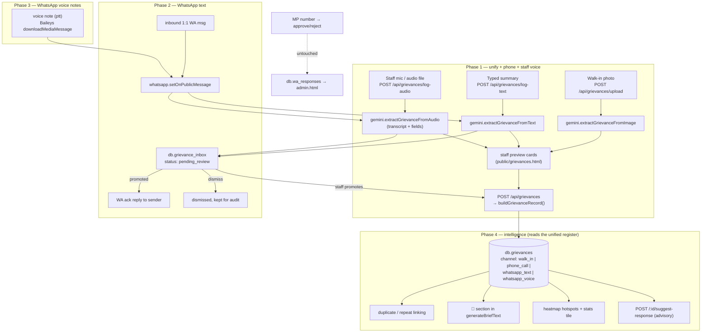

# Multi-Channel Grievance Intake + AI Intelligence Layer

## Context

Today the only structured grievance register is `visitor_forms` — walk-in paper forms photographed by office staff, OCR'd and categorized by Gemini, with a 19-category taxonomy, urgency, a computed `priority_score`, and a resolution-status workflow (`server/index.js:1258-1481`, `public/visitor_forms.html`). Confirmed empty in `data/db.json` (`visitor_forms: []`), so reshaping it carries no migration risk.

In reality grievances also arrive by phone call and WhatsApp (text and voice notes), and none of that is captured. The goal is one register regardless of channel, plus an AI layer for triage, duplicate detection, urgency escalation into the MP's morning brief, hotspot analytics, and advisory response drafting.

Decisions locked in:
1. **Unify** — rename `visitor_forms` → `grievances`, add a `channel` field. One register, one page, one export, one AI pipeline.
2. **WhatsApp = open public intake**, but **nothing auto-publishes**. Every inbound 1:1 message lands in a review inbox with an AI classification attached; a human promotes it into the register.
3. **Auto-acknowledge on capture** — when staff promote an inbox entry, WhatsApp-reply to the sender with the grievance id. No reply for dismissed/chit-chat messages.
4. **Phone-call intake = manual staff entry** — staff types *or dictates* a summary, AI categorizes it like any text grievance. No telephony integration.
5. **Staff voice input** — the Log Grievance modal takes a mic recording or an uploaded audio file, transcribed and categorized by the same AI path. Faster than typing for a busy front desk, and works for Telugu where typing is slow.
6. **Duplicate detection = phone exact match + Fuse.js description similarity + name/village soft hint.**

Assumptions on voice input (you didn't pick, these are the defaults I'd argue for — say the word to flip either):
- **Staff-facing only.** Mic + audio-file upload live in the Log Grievance modal. A public self-service voice page would need an unauthenticated route, abuse protection, and its own queue — materially larger scope, not bundled.
- **Voice is an input method, not a channel.** Staff pick the channel in the modal (walk-in / phone call); the record carries `intake_mode: 'dictated'` and the audio as an attachment. `whatsapp_voice` stays a channel because it's a genuinely different arrival path, not a different way of typing.

The legacy `contact.issues[]` / `pa_issues.html` / `admin.html` approve-reject flow is **out of scope and must remain byte-identical**.

Ship in four phases, each independently deployable.

## Shape of the change



`buildGrievanceRecord()` is the single write path — the API commit, and the inbox promote path, both go through it, so id generation, media persistence, TTD auto-linking and duplicate linking stay identical across channels.

---

## Phase 1 — Unify the model, rename, add manual phone-call intake

### Rename (mechanical, exact scope)
- `db.visitor_forms` → `db.grievances`. Also rename the key in the bundled seed `data/db.json` (it's `[]` — zero risk).
- `VISITOR_IMAGES_PATH` (`server/index.js:27`, dir `visitor_form_images`) → `GRIEVANCE_MEDIA_PATH`, dir `grievance_media`; update `mkdirSync` (36) and usages (1346, 1466, 1478).
- multer instance `uploadVisitorForms` (54) → `uploadGrievanceMedia`, same config.
- Routes `/api/visitor-forms*` → `/api/grievances*`, suffixes unchanged, except `GET /api/visitor-forms/:id/image` → `GET /api/grievances/:id/media` (generalized; Phase 3 adds audio).
- **Route ordering**: register every static-segment route (`/categories`, `/upload`, `/log-text`, `/export.xlsx`, `/export-pdf`, and Phase 4's `/duplicate-check`) *before* any `/:id` route. Today the exports sit at line ~2757, far below `/:id/image`; move them up next to the rest of the grievance block while renaming, so no future single-segment route gets swallowed.
- `buildVisitorFormsRegisterPDF` → `buildGrievancesRegisterPDF`; `categoryLabel` unchanged.
- `public/visitor_forms.html` → `public/grievances.html` (`git mv`); `public/sidebar.js:10` → `/grievances.html` / "Grievances".
- `CLAUDE.md`: page table row, endpoint table rows, `GEMINI_API_KEY` description, and the "Visitor Forms (`server/gemini.js`)" section.
- **Deliberately not renamed** (call this out in the PR so it doesn't read as an oversight): JSON field names `date_of_visit`, `ocr_confidence`, `image_path`, TTD's `source_visitor_form_id`, and the `VF{ts}_{idx}` id prefix. Cosmetically off for non-walk-in channels, many call sites, zero functional gain. Change **display labels only** (show "Date Reported", field stays `date_of_visit`).

### Record shape
Existing fields plus:
```
channel        'walk_in' | 'phone_call' | 'whatsapp_text' | 'whatsapp_voice'   (default 'walk_in')
logged_by      staff name/id, optional, phone_call only
intake_mode    'typed' | 'ocr' | 'dictated'   (provenance; default 'typed')
media_type     'image' | 'audio' | 'pdf'      (absent ⇒ treated as 'image')
transcript     AI transcript, dictated/voice records only
```
`image_path` keeps its name and now holds an audio filename for dictated records — same deliberate no-rename call as `date_of_visit` (see above). Phase 2–4 add fields additively to the same collection.

### `server/gemini.js`
- Broaden the file header beyond "photographed visitor forms".
- Factor `callGemini(parts, responseSchema, timeoutMs = 30000)` out of the fetch/timeout/parse boilerplate at lines 55–93.
- `extractVisitorForm` → `extractGrievanceFromImage` (same signature/behavior; one caller, `server/index.js:1310`).
- **New** `extractGrievanceFromText(text, categories)` — prompt framed as triaging a grievance reported by phone or WhatsApp. Same schema minus `ocr_confidence`, plus `is_grievance: BOOLEAN` and `confidence: enum High/Medium/Low` (classification confidence — Phase 2's inbox surfaces it as a staff hint). Drop `full_name` from `required`; phone/WhatsApp intake often has no name. Text-only parts, no `inline_data`. Reused verbatim by Phase 2.
- **New** `extractGrievanceFromAudio(buffer, mimeType, categories)` — `inline_data` carrying the audio, same schema as the text variant plus a required `transcript: STRING`. Prompt: transcribe first (Telugu / English / mixed, keep the original script, don't translate), then extract from the transcript. Timeout 45s, a documented deviation from `callGemini`'s 30s default because voice runs long. Lands in Phase 1 for staff dictation; Phase 3 reuses it unchanged for WhatsApp voice notes.

### `server/index.js`
- `const GRIEVANCE_CHANNELS = new Set(['walk_in','phone_call','whatsapp_text','whatsapp_voice'])`.
- **Extract `buildGrievanceRecord(db, it, channel)`** from the body of `POST /api/visitor-forms` (1335–1396): validates category/status/urgency, generates the id, persists `image_base64` to `GRIEVANCE_MEDIA_PATH`, computes `priority_score`, and does the `category === 'ttd_letter'` → `buildTtdLetterItem` auto-link. `POST /api/grievances` becomes a thin loop over it. Do this now, not in Phase 2 — Phase 2's promote path depends on it.
- **New** `POST /api/grievances/log-text` — body `{ text, channel, logged_by, full_name, contact_number, village }`; defaults `channel: 'phone_call'`, validated against `GRIEVANCE_CHANNELS`; fails fast on missing `GEMINI_API_KEY` with the same message as `/upload` (1298); calls `extractGrievanceFromText`; clamps category/urgency exactly as `/upload` does (1311-1312); returns `{ ok, items: [{ tmp_id, extracted, priority_score }] }` — **same envelope as `/upload`** so the frontend reuses `renderPreview()` unchanged. Explicit user-typed name/phone/village override AI-extracted values.
- **New** `POST /api/grievances/log-audio` — multipart (`uploadGrievanceMedia.single('audio')`), accepted MIMEs `audio/wav`, `audio/mpeg`, `audio/mp4`, `audio/aac`, `audio/ogg`, `audio/flac` (Gemini's supported inline-audio set — reject anything else with a clear message rather than letting Gemini 400). Calls `extractGrievanceFromAudio`, then returns the **same envelope** as `/log-text` with `transcript` included, so `renderPreview()` still handles it.
  - **Do not** round-trip audio as base64 through the JSON commit body — `express.json` is capped at 10mb (line 48). Instead `/log-audio` writes the file straight to `GRIEVANCE_MEDIA_PATH` as `tmp_{ts}_{rand}.{ext}` and returns that filename as `pending_media`. `buildGrievanceRecord` accepts `it.pending_media`, renames the file to `${id}.{ext}`, and sets `image_path` + `media_type: 'audio'`.
  - Orphan cleanup: `DELETE /api/grievances/pending-media/:filename` (basename-guarded, must match `^tmp_`) called by "Discard" in the preview UI, plus a startup sweep deleting `tmp_*` files older than 24h.
- `GET /api/grievances/:id/media`: serve by `media_type` with the correct `Content-Type` (`audio/wav` etc.) instead of assuming image; absent `media_type` ⇒ image, so existing behavior is unchanged. (Moved here from Phase 3 — audio records exist from Phase 1 onward.)
- `POST /api/grievances` (commit): accept `it.channel`, validate, default `'walk_in'` — the existing walk-in flow never sends `channel` and must keep working untouched. Also accept `intake_mode`, `transcript`, `pending_media`.
- `GET /api/grievances`: add optional `?channel=` alongside `from`/`to`/`category`/`status`. Same filter added to both export routes.
- Excel export: add a `Channel` column. PDF register: add a "Channel" column (~55px) — the row is already 6 columns at 515px total, so trim `Status` to 75 to fit A4 margins.

### `public/grievances.html`
- Swap all `/api/visitor-forms*` fetches to `/api/grievances*`; title/labels → "Grievances".
- **New "Log Grievance" button** beside "Upload Forms" → modal with a channel selector (Phone call / Walk-in), a free-text summary textarea, optional name / phone / village / logged-by inputs, and **three ways to fill the summary**:
  1. type it → `POST /api/grievances/log-text`
  2. 🎤 **Record** → browser mic → `POST /api/grievances/log-audio`
  3. 📎 **Attach audio** (a forwarded voice note, a call recording) → same endpoint
- Mic capture specifics (this is the fiddly part, get it right):
  - `navigator.mediaDevices.getUserMedia({ audio: true })` + `MediaRecorder`. Guard for `!navigator.mediaDevices` (non-HTTPS origins) and for a denied permission — fall back to the textarea with a toast, never a dead button.
  - **Transcode to WAV before upload.** MediaRecorder emits WebM/Opus in Chrome and MP4 in Safari; WebM is *not* in Gemini's supported inline-audio list. Decode the recorded blob with `AudioContext.decodeAudioData`, downmix to mono, resample to 16 kHz, and write a 16-bit PCM WAV header client-side (~30 KB/s, so a 3-minute dictation is ~5.5 MB — under the 15 MB multer cap). No new dependency, and the MIME is guaranteed acceptable.
  - Cap recording at 5 minutes with a live timer and a visible stop button; show a "Transcribing…" state while the request is in flight (Gemini audio takes noticeably longer than text).
- Preview cards for audio-sourced items show an `<audio controls>` playback of the local blob plus the **transcript in an editable textarea** — staff correct transcription errors before saving, the same pattern as correcting an OCR read today. Text-sourced items hide the OCR-confidence badge and filename header.
- `saveAllPreview()` (647) passes `channel`, `intake_mode`, `transcript` and `pending_media` per item; "Discard" calls the pending-media delete so abandoned recordings don't accumulate.
- Table: "Channel" column with a per-channel lucide icon (`user`/`phone`/`message-circle`/`mic`) and a channel filter next to the category pills. The media button (403) already guards on `image_path` — repoint it at `/api/grievances/${id}/media`.

### Must not change
Legacy `issues` / `pa_issues.html` / `admin.html` / `contact.open_grievance` / `/api/issue*`; walk-in OCR + TTD auto-link *behavior*; `scripts/setup_db.js`.

### Pre-existing limitation (not fixed here)
`POST /api/grievances` carries **images** as base64 inside a JSON body against `express.json({ limit: '10mb' })` (48) while upload allows 20 × 15MB, so large photo batches already fail today. Unchanged by this work — note it, don't fix it here. The new audio path deliberately sidesteps it via `pending_media` filenames rather than base64; converting the image path to the same mechanism is the obvious follow-up, but it's a separate change.

### Verify
1. `npm install` (node_modules is empty in a fresh clone), then `node server/index.js` — clean start, `data/grievance_media/` created.
2. `/grievances.html` loads; sidebar link works.
3. Upload a form photo → preview → save → record has `channel: 'walk_in'`, `/api/grievances/:id/media` serves the photo, both exports show a Channel column.
4. "Log Grievance" → type a sentence → Extract → AI-filled preview → save → record has `channel: 'phone_call'`, `intake_mode: 'typed'`, no `image_path`.
5. **Voice**: hit Record, speak a grievance in Telugu and again in English, stop → transcript appears in the preview and is editable → save → record has `intake_mode: 'dictated'`, a `transcript`, `media_type: 'audio'`, and `/api/grievances/:id/media` plays back in the browser. Repeat via the attach-file path with a `.m4a`.
6. Record then **Discard** → the `tmp_*` file is gone from `data/grievance_media/`. Deny mic permission → clean toast, textarea still usable.
7. Force `category: 'ttd_letter'` on one walk-in and one phone-call record → TTD letter auto-created and `ttd_letter_refs` populated for both.
8. `git diff` shows zero changes under `pa_issues.html`, `admin.html`, `/api/issue*`, `scripts/`.

---

## Phase 2 — WhatsApp text intake, staff-reviewed inbox

### `server/whatsapp.js`
- Restructure `setupIncomingHandler` (29–58) to branch by sender instead of dropping non-MP senders:
  - `msg.key.remoteJid?.endsWith('@g.us')` → skip entirely (public intake is 1:1 only).
  - `sender === MP_NUMBER` → the **existing** approve/reject logic, unmodified.
  - any other sender → extract text the same way; if non-empty, invoke the new callback.
- **New export** `setOnPublicMessage(cb)`, parallel to `setOnIncomingMessage`. The MP contract stays untouched.
- In-memory rate guard: `Map<sender, timestamps[]>`, >5 messages / 10 min → still forward, but tagged `{ rateLimited: true }` so `index.js` skips the Gemini call. Caps spend under a flood without dropping anything.

### `server/index.js`
- Register `wa.setOnPublicMessage(...)` inside the existing IIFE (277–352), beside the MP handler.
- **New collection** `db.grievance_inbox`:
  `{ id: 'INB{ts}', wa_jid, sender_phone, text, received_at, classification: {…}|null, status: 'pending_review'|'promoted'|'dismissed', grievance_id: null }`
- Handler: `rateLimited` → store with `classification: null`. Otherwise call `extractGrievanceFromText` and store the full result (including `is_grievance` and `confidence`) as `classification`. **Status is always `pending_review`** — nothing reaches the register without a human. Gemini failures are caught and stored as `classification: null` with an `error` string; the entry still queues.
- New endpoints:
  - `GET /api/grievance-inbox?status=` — list, newest first.
  - `POST /api/grievance-inbox/:id/promote` — body is the staff-reviewed field set; calls `buildGrievanceRecord(db, fields, 'whatsapp_text')`, sets `status: 'promoted'` + `grievance_id`, then **sends the ack**: `wa.default(\`Your grievance has been recorded with the MP's office. Reference: ${id}. We will follow up.\`, entry.sender_phone)` wrapped in try/catch — a WhatsApp failure must not fail the promote; record the outcome on the entry as `ack_sent: true|false`.
  - `POST /api/grievance-inbox/:id/dismiss` — `status: 'dismissed'`, no reply sent.
  - `DELETE /api/grievance-inbox/:id` — hard delete for cleanup.

### Frontend
- **New page** `public/grievance_inbox.html` ("WhatsApp Inbox"), added to `sidebar.js` `LINKS` (icon `inbox`). Table of `pending_review` entries: raw text, sender phone, received time, and the AI's suggested category/urgency/confidence as a hint chip. "Promote" opens a pre-filled preview/edit card (same markup as the grievances preview card); "Dismiss" one-click. A status toggle shows `dismissed` / `promoted` history for audit.
- A pending-count badge on the inbox sidebar link, polled on page load, so staff notice queued messages.
- `grievances.html`: channel filter gains "WhatsApp (Text)".

### Verify
1. Approve/reject from the MP number — still lands in `wa_responses` / `admin.html` exactly as before (regression check first).
2. Message from any other number — appears in the inbox as `pending_review` with an AI suggestion; **does not** appear in the register.
3. Promote it — record appears in `grievances.html` as `whatsapp_text`, and the sender receives the ack message containing the reference id.
4. Dismiss a chit-chat entry — no ack sent, entry visible under the dismissed toggle.
5. Send >5 rapid messages from one number — later ones store `classification: null` (no Gemini call, check server logs).
6. Message the linked number from inside a group — nothing captured.

---

## Phase 3 — WhatsApp voice notes

### `server/whatsapp.js`
- Import `downloadMediaMessage` from Baileys (confirm the export name against the installed `@whiskeysockets/baileys@7.0.0-rc*` after `npm install` — it moved packages between v5 and v6). In the non-MP branch, detect `msg.message.audioMessage?.ptt === true` with no text; download via `downloadMediaMessage(msg, 'buffer', {}, { logger: silent, reuploadRequest: sock.updateMediaMessage })`; forward `{ audio: { buffer, mimeType }, sender, ... }`. Purely additive — text messages behave exactly as in Phase 2.

### `server/gemini.js`
Nothing new — `extractGrievanceFromAudio` and the `media_type`-aware media route both landed in Phase 1 for staff dictation. WhatsApp voice notes arrive as ogg/opus, which Gemini accepts inline directly, so no transcoding is needed on this path.

### `server/index.js`
- In the public-message handler, if `audio` is present: write the buffer to `GRIEVANCE_MEDIA_PATH` as `${inboxId}.ogg` **before** classification, call `extractGrievanceFromAudio`, and store `audio_path` + `transcript` on the inbox entry. Everything downstream (always `pending_review`, promote, ack) is identical; promote passes `channel: 'whatsapp_voice'` and reuses Phase 1's `pending_media` adoption path.
- File ownership rule: promote **transfers** the file — the grievance record stores the same filename with `media_type: 'audio'`. `DELETE /api/grievance-inbox/:id` unlinks the file only when `grievance_id` is null, so promoted records never lose their audio.
- `GET /api/grievance-inbox/:id/audio` to stream a queued entry's audio for the inbox player.

### Frontend
- `grievance_inbox.html`: voice entries render an inline `<audio controls src="/api/grievance-inbox/:id/audio">` plus the AI transcript in an editable textarea — staff correct transcription errors before promoting, same pattern as correcting OCR reads today.
- `grievances.html`: `whatsapp_voice` rows get the mic icon. The audio playback and transcript UI already exist from Phase 1 — reuse, don't rebuild.

### Verify
1. Voice note describing a grievance from a non-MP number → downloaded, transcribed, queued as `pending_review` with a playable control and editable transcript.
2. Promote it → register row plays back via `/api/grievances/:id/media` and shows the transcript; sender gets the ack.
3. Delete an unpromoted voice entry → audio file gone from `grievance_media/`. Delete a promoted one's inbox entry → audio still plays from the record.
4. Text-only WhatsApp and MP approve/reject unaffected.

---

## Phase 4 — Intelligence layer

### 4a. Duplicate / repeat detection
- Three signals, in `findGrievanceDuplicates(db, { contact_number, full_name, village, issue_description }, excludeId)` — modeled on `findTtdDuplicates` (1171-1177):
  1. **exact** — `normalizePhone(contact_number)` match (reuse `server/index.js:1751`). Auto-links.
  2. **similar text** — Fuse.js over `issue_description` (already a dependency, same construction as `/api/contacts` at 530) with a tight threshold (~0.35); returned as `possible`, never auto-linked.
  3. **same person hint** — trimmed case-insensitive `full_name` + `village`; returned as `possible`.
- Each result carries `{ id, date_of_visit, channel, category, match_type: 'phone'|'text'|'name_village' }`.
- Wire into `buildGrievanceRecord` (so every channel benefits): store `linked_grievance_ids` bidirectionally on `match_type === 'phone'` matches only, the same way `ttd_letter_refs` is maintained. Return `duplicate_warnings` in the POST response for the other two types.
- **New** `GET /api/grievances/duplicate-check?phone=&text=` for live warnings as staff type — mirrors `/api/ttd-letters/check-duplicate` (1192).
- Frontend: warning banner inside the preview/edit card linking to prior grievances; a "Linked Grievances" block on each record row.

### 4b. Urgency escalation into the morning brief
- Escalation-worthy: `urgency === 'High'` OR `priority_score >= 80`, AND `resolution_status !== 'Resolved'`, AND (`!escalated_at` OR unresolved >3 days since `escalated_at`).
- `generateBriefText` (355) takes a 5th param `grievances` and emits a `*🚨 High-Priority Grievances:*` section after "Today's Engagements" and before "Submitted Reports" — up to 5 entries, each `id · category label · village · score · N days open`. Thread `db.grievances || []` through both call sites: `sendWhatsAppBrief` (462) and `GET /api/generate-brief` (494).
- Stamp `escalated_at` **only on an actual send** — `sendWhatsAppBrief` already re-reads and writes the DB after sending (482-485), so set it there when `logEntry.status === 'sent'`. The preview endpoint must not stamp.
- One brief pipeline, no second messaging path.

### 4c. Hotspots on the heatmap
- `public/heatmap.html` `loadData()` (152-183) currently aggregates only `contact.open_grievance`. Add a third `fetch('/api/grievances')` and accumulate `grievanceCountLive`, `topCategory`, `avgPriorityScore` per mandal as **additional** fields on `mandalStats` — the legacy `grievanceCount` stays, they measure different things.
- New toggle chip `Grievance Hotspots` beside `Contact Density` / `Priority Score` (120-122), handled as a third branch in `buildMarkersAndHeat()`'s `intensity` calc (222). Popup gains live-register rows.
- `/api/stats` (1569): new field `open_grievances_register` = grievances with `resolution_status !== 'Resolved'`. `public/index.html` gets a tile labeled distinctly from the existing legacy "Open Grievances" tile (which reads `with_grievances`) so the two systems aren't confused.

### 4d. AI-suggested response drafts (advisory only)
- `server/gemini.js`: `suggestGrievanceResponse(grievance)` → `{ suggested_response, suggested_next_action }`, text-only via `callGemini`.
- `POST /api/grievances/:id/suggest-response` — **on demand only**, never on save. Writes to new fields `suggested_response` / `suggested_next_action` and **never** touches `action_taken` / `action_to_be_taken`.
- Frontend: collapsible "AI Suggested Response" panel in the edit row with "Suggest" and "Copy into Action To Be Taken" (fills the textarea; staff still clicks Save).

### Explicitly deferred
Wiring the new register into `scripts/setup_db.js`'s `hasGrievance` PPS component (hardcoded `0` at line 113, no live recompute path exists). That's a contact-scoring feature that could reshape every contact's tier and priority — separate design, separate verification, not bundled here.

### Verify
1. Save two grievances sharing a phone number across different channels → `duplicate_warnings` on the second, bidirectional `linked_grievance_ids`, live warning in the Log Grievance modal as the phone is typed. Save a third with a similar description and no phone → shows as a `possible` text match, not auto-linked.
2. Create a High-urgency unresolved grievance → `/api/generate-brief` preview shows the 🚨 section with no `escalated_at` written; `/api/send-brief` writes it. Mark Resolved → gone from the next brief.
3. `/heatmap.html` — "Grievance Hotspots" toggle re-renders; popups show live-register counts distinct from the legacy count.
4. `/index.html` — new tile count differs from the legacy tile and matches unresolved records.
5. "Suggest" on a record populates the advisory panel; `action_taken` / `action_to_be_taken` unchanged in `db.json` until staff copy and save.
6. Final diff review: `pa_issues.html`, `admin.html`, `/api/issue*`, `scripts/setup_db.js` untouched across all four phases.

## Files touched
- `server/index.js` — rename, `buildGrievanceRecord`, log-text + log-audio + media serving + inbox + duplicate + suggest endpoints, brief escalation, stats.
- `server/gemini.js` — `callGemini` helper, image/text/audio extraction, response suggestion.
- `server/whatsapp.js` — sender branching, `setOnPublicMessage`, rate guard, voice-note download.
- `public/visitor_forms.html` → `public/grievances.html` — rename, Log Grievance modal with mic + audio upload + WAV transcode, channel column, duplicate banner, suggestion panel.
- `public/grievance_inbox.html` — new (Phase 2, extended in Phase 3).
- `public/heatmap.html`, `public/index.html`, `public/sidebar.js`, `CLAUDE.md`, `data/db.json` (seed key rename).
